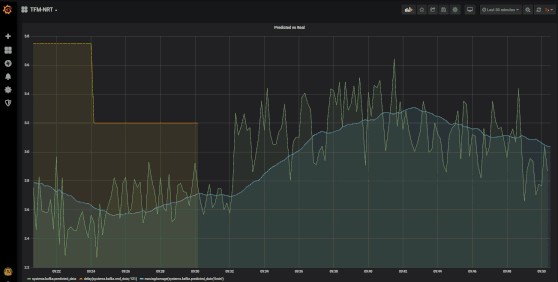
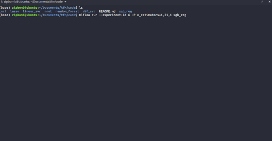
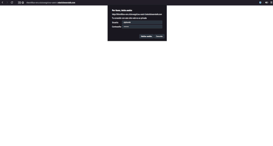

## NRT pipeline for quality assurance in a mining process
___

This repository contains the code, data and documentation generated for my Master's degree final project. The main objective of the project was to showcase the effectiveness of Near Real-Time data pipelines on complex environments that critically demand low response times. The repository contains the following:

- **Data pipeline implementation** - Kafka and KSQL configuration files, scripts and UDF source code can be found at [/kafka](kafka).
- **Integral ML experimentation platform** - Scripts for building an ML collaborative experimentation platform based on *MLflow* in AWS Elastic Beanstalk with authentication and load-balancing can be found at [/mlflow](mlflow). You can find *scikit-learn*'s wrappers to record metadata and get dependencies managed by *MLflow* in [/code](code). 
- **Real use case analysis** - We've analysed and trained some models to solve Kaggle's [Quality prediction in a Mining Process](https://www.kaggle.com/edumagalhaes/quality-prediction-in-a-mining-process) problem. You can find analysis and processing made over the dataset in [/notebook](notebook) and train and test splits in [/data](data).
- **Real-time visualization** - Scripts to build a Docker Swarm containing Graphite + Grafana and a Kafka consumer for real-time plots. See [/visualization](visualization).

Further explanations can be found in the README of each specific directory. Also, documentation for the project (currently only available in GL) can be found at [/doc](doc).

### Demo

